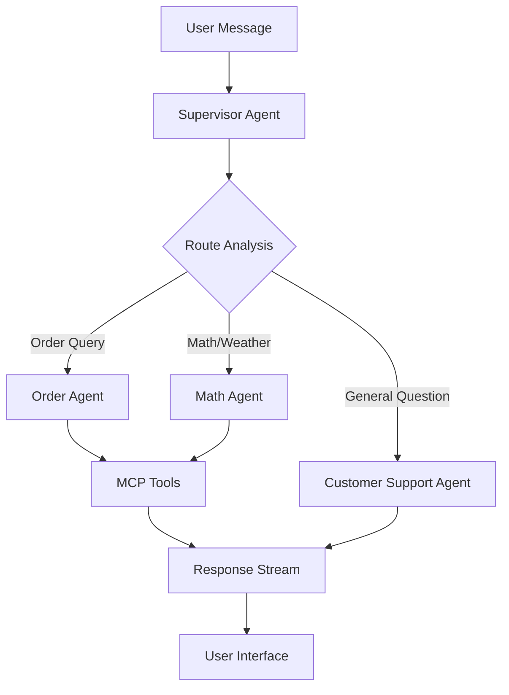

# 🤖 LangGraph Multi-Agent System

[](https://www.python.org/downloads/)
[](https://langchain-ai.github.io/langgraph/)
[](https://www.postgresql.org/)
[](https://fastapi.tiangolo.com/)
[](https://modelcontextprotocol.io/)

> A production-ready multi-agent system demonstrating advanced LangGraph patterns with MCP tool integration, PostgreSQL persistence, and a ChatGPT-like web interface.

## ✨ Key Features

### 🏗️ **Advanced Multi-Agent Architecture**
- **Supervisor Agent**: Intelligent request routing and coordination
- **Specialized Agents**: Order management, customer support, and general assistance
- **Dynamic Agent Configuration**: Database-driven agent management
- **Real-time Event Streaming**: Live tool execution visualization

### 🛠️ **Model Context Protocol (MCP) Integration**  
- **6 Built-in Tools**: Calculator, weather, order management (4 tools)
- **Dynamic Tool Discovery**: Automatic tool registration and assignment
- **External MCP Servers**: Support for custom tool extensions
- **Tool Event Streaming**: Real-time tool execution monitoring

### 💬 **ChatGPT-like Web Interface**
- **Streaming Responses**: Real-time message generation
- **Persistent Chat History**: Cross-session conversation memory
- **Agent Management UI**: Visual agent configuration and monitoring
- **MCP Server Management**: Dynamic tool server configuration

### 🗄️ **Enterprise-Grade Persistence**
- **PostgreSQL Integration**: Async checkpointer with connection pooling
- **LangGraph Memory**: Automatic conversation state management
- **Clean Architecture**: Domain-driven design with repository pattern
- **Database Migrations**: Proper schema versioning and setup

### 🧪 **Comprehensive Testing**
- **50+ Test Cases**: Unit, integration, and API tests
- **Mocked Dependencies**: Fast, reliable test execution
- **Test Automation**: CI/CD ready test suite
- **Coverage Reporting**: Comprehensive code coverage analysis

---

## 🚀 Quick Start Guide

### 📋 Prerequisites

| Component | Version | Purpose |
|-----------|---------|---------|
| **Python** | 3.11+ | Runtime environment |
| **PostgreSQL** | 15+ | Data persistence |
| **Google API Key** | Gemini | LLM inference |

### 🔧 Installation

```bash
# 1. Clone the repository
git clone https://github.com/your-org/langgraph-multi-agent-system.git
cd langgraph-multi-agent-system

# 2. Create virtual environment
python -m venv venv
source venv/bin/activate  # On Windows: venv\Scripts\activate

# 3. Install dependencies
pip install -r requirements.txt

# 4. Configure environment
cp .env.example .env
```

### 🔐 Environment Configuration

Create `.env` file with your configuration:

```bash
# Required
GOOGLE_API_KEY=your-google-ai-api-key-here

# Optional (with defaults)
GEMINI_MODEL=gemini-1.5-flash
DATABASE_URL=postgresql://localhost:5432/langgraph_chats
LOG_LEVEL=INFO
HOST=0.0.0.0
PORT=8000
```

### 🗄️ Database Setup

```bash
# macOS (Homebrew)
brew install postgresql@15
brew services start postgresql@15
createdb langgraph_chats

# Ubuntu/Debian
sudo apt install postgresql postgresql-contrib
sudo systemctl start postgresql
sudo -u postgres createdb langgraph_chats

# Run database migrations (REQUIRED)
python scripts/setup_database.py
```

### ▶️ Launch Application

```bash
python run_web.py
```

**🌐 Access Points:**
- **Chat Interface**: http://localhost:8000
- **Agent Management**: http://localhost:8000/agents  
- **MCP Management**: http://localhost:8000/mcp
- **API Documentation**: http://localhost:8000/docs

---

## 🏗️ Architecture Deep Dive

### 🔀 Multi-Agent Coordination Flow



### 🧩 Core Components

#### **1. Agent System (`src/agents/`)**
- **`multi_agent_system.py`**: Central coordinator with MCP integration
- **`supervisor_agent.py`**: LangGraph-based routing and orchestration
- **`specialized_agent.py`**: Generic specialized agent implementation

#### **2. Clean Architecture (`src/`)**
```
src/
├── domain/
│   ├── entities/          # Core business objects
│   ├── repositories/      # Data access interfaces  
│   └── services/          # Business logic
├── application/
│   ├── use_cases/         # Application workflows
│   ├── handlers/          # Request processing
│   └── dto/               # Data transfer objects
└── infrastructure/
    ├── database/          # PostgreSQL implementations
    ├── llm/               # Gemini client
    ├── mcp/               # MCP client implementations
    └── web/               # FastAPI infrastructure
```

#### **3. Web Interface (`web/`)**
- **Real-time Streaming**: Server-Sent Events for live responses
- **Agent Management**: Dynamic agent configuration interface
- **MCP Management**: Tool server configuration and monitoring
- **Responsive Design**: Mobile-friendly ChatGPT-like UI

### 🛠️ Available Tools

#### **Basic Tools Server (`mcp_server.py`)**
| Tool | Function | Example |
|------|----------|---------|
| `calculate` | Math expressions | `"2 + 2 * 3"` → `"8.0"` |
| `get_weather` | City weather (mock) | `"Tokyo"` → `"Clear, 68°F"` |

#### **Order Management Server (`order_server.py`)**
| Tool | Function | Example |
|------|----------|---------|
| `get_order` | Retrieve order details | `"ORD-001"` → Order information |
| `update_order_status` | Change order status | `"ORD-001", "shipped"` |
| `list_orders` | Filter orders by status | `"pending"` → Filtered list |
| `create_order` | Create new order | Customer info → New order ID |

---

## 🗄️ Database Schema & Management

### 📊 Table Structure

#### **Core Application Tables**
```sql
-- Agent Configurations (Dynamic multi-agent setup)
CREATE TABLE agent_configurations (
    id UUID PRIMARY KEY,
    name VARCHAR(255) UNIQUE NOT NULL,
    agent_type VARCHAR(50) CHECK (agent_type IN ('supervisor', 'specialized')),
    is_active BOOLEAN DEFAULT true,
    config JSONB NOT NULL,  -- Flexible agent configuration
    created_at TIMESTAMP DEFAULT CURRENT_TIMESTAMP
);

-- MCP Server Configurations (Tool management)
CREATE TABLE mcp_configurations (
    id UUID PRIMARY KEY,
    name VARCHAR(255) UNIQUE NOT NULL,
    server_type VARCHAR(50) CHECK (server_type IN ('internal', 'external')),
    is_active BOOLEAN DEFAULT true,
    config JSONB NOT NULL,  -- Server connection details
    created_at TIMESTAMP DEFAULT CURRENT_TIMESTAMP
);

-- Chat Metadata (UI sidebar history)
CREATE TABLE chat_metadata (
    thread_id VARCHAR(255) PRIMARY KEY,
    title VARCHAR(500),
    created_at TIMESTAMP DEFAULT CURRENT_TIMESTAMP,
    updated_at TIMESTAMP DEFAULT CURRENT_TIMESTAMP
);
```

#### **LangGraph Checkpoint Tables (Auto-created)**
- `checkpoints`: Conversation state snapshots
- `checkpoint_writes`: Individual message writes
- `checkpoint_blobs`: Binary data storage
- `checkpoint_migrations`: Schema version tracking

### 🔍 Essential Database Queries

#### **System Health Monitoring**
```sql
-- Agent system overview
SELECT 
    agent_type,
    COUNT(*) as total,
    COUNT(*) FILTER (WHERE is_active) as active,
    ARRAY_AGG(name ORDER BY name) as agents
FROM agent_configurations 
GROUP BY agent_type;

-- MCP server status
SELECT 
    name,
    server_type,
    is_active,
    config->>'command' as command,
    config->'args' as arguments
FROM mcp_configurations
ORDER BY server_type, name;
```

#### **Conversation Analytics**
```sql
-- Chat activity summary
SELECT 
    DATE(created_at) as date,
    COUNT(*) as new_chats,
    COUNT(DISTINCT substring(thread_id, 1, 8)) as unique_users
FROM chat_metadata 
WHERE created_at >= CURRENT_DATE - INTERVAL '7 days'
GROUP BY DATE(created_at)
ORDER BY date DESC;

-- Memory usage analysis
SELECT 
    COUNT(*) as total_checkpoints,
    COUNT(DISTINCT thread_id) as unique_conversations,
    AVG(LENGTH(checkpoint)) as avg_checkpoint_size,
    MAX(created_at) as latest_activity
FROM checkpoints;
```

### 🛠️ Database Administration

```bash
# Connect to database
psql langgraph_chats

# Database maintenance
\dt                          # List all tables
\d+ agent_configurations     # Detailed table structure
\di                          # List indexes
\x                           # Toggle expanded display

# Backup and restore
pg_dump langgraph_chats > backup.sql
psql langgraph_chats < backup.sql
```

---

## 🧪 Testing & Quality Assurance

### 🎯 Test Suite Overview

| Test Category | Files | Tests | Coverage |
|---------------|-------|-------|----------|
| **Unit Tests** | `test_mcp_unit.py` | 17 | Domain logic |
| **API Tests** | `test_mcp_api_working.py` | 20 | REST endpoints |
| **Agent Tests** | `test_agents.py` | 8 | Agent behavior |
| **Tool Tests** | `test_tools.py` | 5 | MCP tools |
| **Total** | **4 files** | **50 tests** | **Comprehensive** |

### ⚡ Running Tests

```bash
# Quick test run (recommended)
python run_tests.py --working

# All tests with coverage
python run_tests.py --all --coverage

# Specific test categories
python run_tests.py --unit      # Unit tests only
python run_tests.py --api       # API tests only

# Development testing
pytest tests/test_mcp_unit.py -v
pytest --cov=src --cov-report=html
```

### 📊 Test Architecture

#### **Mocking Strategy**
- **Database**: In-memory SQLite for fast tests
- **LLM Calls**: Mocked responses for reliability
- **MCP Servers**: Simulated tool execution
- **External APIs**: Controlled test data

#### **Test Categories**
- **Unit Tests**: Domain logic, entity validation, business rules
- **Integration Tests**: Database operations, MCP client interactions
- **API Tests**: HTTP endpoints, request/response handling
- **E2E Tests**: Complete user workflows and agent interactions

---

## 🔧 Development & Extensibility

### 🚀 Adding New Agents

1. **Database Configuration**:
```sql
INSERT INTO agent_configurations (name, agent_type, config) VALUES (
    'Email Agent',
    'specialized',
    '{
        "description": "Handles email operations",
        "model_config": {"model_name": "gemini-1.5-flash"},
        "mcp_tool_assignments": ["send_email", "read_email"],
        "managed_agents": []
    }'::jsonb
);
```

2. **Update Supervisor**: Add agent to managed agents list

### 🛠️ Creating Custom MCP Tools

1. **Create MCP Server**:
```python
# email_server.py
from mcp.server.fastmcp import FastMCP

mcp = FastMCP("Email Management Server")

@mcp.tool()
def send_email(to: str, subject: str, body: str) -> str:
    """Send email via SMTP."""
    # Implementation here
    return f"Email sent to {to}"

if __name__ == "__main__":
    mcp.run(transport="stdio")
```

2. **Register MCP Server**:
```sql
INSERT INTO mcp_configurations (name, server_type, config) VALUES (
    'Email Server',
    'external',
    '{
        "command": "python",
        "args": ["email_server.py"],
        "transport": "stdio"
    }'::jsonb
);
```

### 🎨 Customizing the Web Interface

#### **Templates** (`web/templates/`)
- `chat.html`: Main chat interface
- `agents.html`: Agent management dashboard
- `mcp_management.html`: MCP server configuration

#### **Static Assets** (`web/static/`)
- `style.css`: ChatGPT-inspired styling
- `script.js`: Real-time streaming and UI interactions
- `management.css`: Admin interface styling

### 📚 Configuration Management

#### **Agent Configuration Schema**
```typescript
interface AgentConfiguration {
  description: string;
  model_config: {
    model_name: string;
    temperature?: number;
    max_tokens?: number;
  };
  mcp_tool_assignments: string[];  // Tool names
  managed_agents: string[];        // For supervisor agents
}
```

#### **MCP Configuration Schema**
```typescript
interface MCPConfiguration {
  command: string;           // Executable command
  args: string[];           // Command arguments
  transport: "stdio";       // Communication protocol
  env?: Record<string, string>;  // Environment variables
}
```

---

## 🚨 Troubleshooting Guide

### 🔍 Common Issues & Solutions

#### **Database Connection Issues**
```bash
# Check PostgreSQL status
brew services list | grep postgresql
sudo systemctl status postgresql

# Verify database exists
psql -l | grep langgraph_chats

# Test connection
psql langgraph_chats -c "SELECT version();"
```

#### **Agent Initialization Failures**
```bash
# Check API key
echo $GOOGLE_API_KEY

# Verify MCP servers
python mcp_server.py --help
python order_server.py --help

# Review application logs
tail -f logs/application.log
```

#### **MCP Tool Issues**
```bash
# Test MCP server manually
echo '{"method": "tools/list"}' | python mcp_server.py

# Check tool assignments in database
psql langgraph_chats -c "
  SELECT name, config->'mcp_tool_assignments' 
  FROM agent_configurations 
  WHERE agent_type = 'specialized';
"
```

### 📊 Performance Monitoring

#### **Database Performance**
```sql
-- Checkpoint table growth
SELECT 
    schemaname,
    tablename,
    pg_size_pretty(pg_total_relation_size(schemaname||'.'||tablename)) as size
FROM pg_tables 
WHERE tablename LIKE 'checkpoint%'
ORDER BY pg_total_relation_size(schemaname||'.'||tablename) DESC;

-- Active connections
SELECT count(*) as active_connections 
FROM pg_stat_activity 
WHERE state = 'active';
```

#### **Application Metrics**
```bash
# Memory usage
ps aux | grep "python.*run_web.py"

# Response times
curl -w "@curl-format.txt" -o /dev/null -s http://localhost:8000/api/health

# Log analysis
grep "ERROR" logs/*.log | tail -20
```

### 🔧 Development Tools

```bash
# Code formatting
black src/ tests/
isort src/ tests/

# Type checking
mypy src/

# Security scanning
bandit -r src/

# Dependency checking
pip-audit
```

---

## 🤝 Contributing

### 📋 Contribution Guidelines

1. **Fork & Clone**: Create your own fork of the repository
2. **Branch**: Create feature branches (`feature/new-agent-type`)
3. **Test**: Ensure all tests pass (`python run_tests.py --all`)
4. **Document**: Update README and docstrings
5. **PR**: Submit pull request with clear description

### 🎯 Development Workflow

```bash
# Setup development environment
git clone your-fork-url
cd langgraph-multi-agent-system
python -m venv venv
source venv/bin/activate
pip install -r requirements.txt -r requirements-dev.txt

# Run tests before changes
python run_tests.py --all

# Make your changes...

# Verify everything works
python run_tests.py --all --coverage
python run_web.py  # Manual testing

# Submit PR
git push origin feature/your-feature
```

### 🐛 Bug Reports

Include in your bug report:
- Operating system and Python version
- Full error traceback
- Steps to reproduce
- Database schema version (`SELECT * FROM checkpoint_migrations;`)

### 💡 Feature Requests

For new features, please:
- Open an issue with detailed description
- Provide use case and business value
- Consider implementation complexity
- Discuss architectural impact

---

## 📄 License & Credits

### 📜 License
This project is licensed under the **MIT License** - see the [LICENSE](LICENSE) file for details.

### 🙏 Acknowledgments

- **[LangGraph](https://langchain-ai.github.io/langgraph/)**: Advanced agent orchestration framework
- **[Model Context Protocol](https://modelcontextprotocol.io/)**: Tool integration standard
- **[FastAPI](https://fastapi.tiangolo.com/)**: Modern Python web framework
- **[PostgreSQL](https://www.postgresql.org/)**: Reliable database system

### 🌟 Star History

If this project helped you, please consider giving it a ⭐ on GitLab!

---

<div align="center">

**[🏠 Home](/)** | **[📖 Documentation](/docs)** | **[🐛 Issues](/issues)** | **[🚀 Contribute](/contribute)**

Made with ❤️ by the LangGraph community

</div>